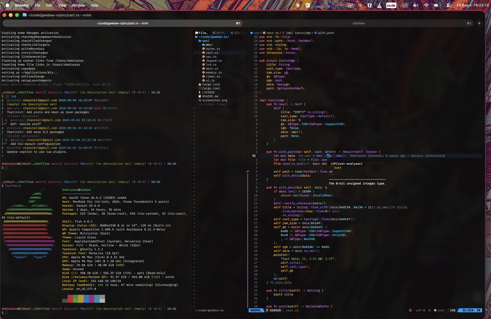

# Chaosteil's Dotfiles

## Description

Just various config files with some setup files for quickly setting up a new
dev environment on another computer.

The primary for this is going to be [nix](https://nixos.org/download/), where the instructions on how to
install everything is outlined in `nix/flake.nix`. This is definitely the
fastest way.

The configurations are both valid for OSX (either nix-darwin or home-manager)
and a Linux system where home-manager is primarily used. Additionally the configs
are actually also [stow](https://www.gnu.org/software/stow/manual/)-compatible if so desired.

## Screenshot

